# Data Analytics Hackathon: Dashboard Essentials - Strategic Planning

**Event**: Code Institute Data Analytics Bootcamp Team Hackathon  
**Duration**: 3 Days (July 2025)  
**Team Structure**: 4 members with specialized roles  
**Objective**: Build interactive dashboards utilising Power BI Desktop or Tableau Public  

---

## 🎯 Hackathon Overview

### Core Challenge
Design and implement a complete data analytics pipeline from raw data to interactive dashboard, working collaboratively in a team of four with defined specialisations.

### Strategic Goals
1. **Technical Mastery**: ETL pipeline, interactive dashboards, data storytelling
2. **Team Collaboration**: Role-based responsibilities with shared accountability  
3. **Professional Development**: Real-world data analytics workflow experience
4. **Portfolio Building**: Showcase-ready project for career advancement

---

## 🏗️ Team Structure & Role Strategy

### Julian Elliott: Project Manager
**Rationale**: Aligns with my organised knowledge management approach and AI-powered second brain methodology

**Key Responsibilities:**
- **Day 1**: Ideation facilitation, repository setup, user story mapping, progress monitoring
- **Day 2**: Sprint management, quality assurance, stakeholder preparation  
- **Day 3**: Documentation completion, presentation orchestration, final integration

**AI Integration**: Use Claude for project planning, documentation structure, progress tracking

---

## 📊 Project Dataset

### Dataset Overview: Online Retail Transactions

**Dataset**: UK-based Online Retail Transactions  
**Time Period**: 01/12/2010 - 09/12/2011  
**Records**: 541,909 transactions  
**Features**: 8 variables  
**File Size**: 22.6 MB  

#### Dataset Characteristics
- **Type**: Multivariate, Sequential, Time-Series
- **Domain**: E-commerce business transactions
- **Company Profile**: UK non-store online retailer specialising in unique all-occasion gifts
- **Customer Base**: Mix of individual customers and wholesalers
- **Data Quality**: Complete dataset with no missing values

#### Key Variables
| Variable | Type | Description |
|----------|------|-------------|
| **InvoiceNo** | Categorical | 6-digit transaction ID (prefix 'c' = cancellation) |
| **StockCode** | Categorical | 5-digit product identifier |
| **Description** | Categorical | Product name |
| **Quantity** | Integer | Items per transaction |
| **InvoiceDate** | Date/Time | Transaction timestamp |
| **UnitPrice** | Continuous | Product price per unit (£ sterling) |
| **CustomerID** | Categorical | 5-digit customer identifier |
| **Country** | Categorical | Customer residence country |

#### Analysis Opportunities
- **Customer Segmentation**: RFM analysis (Recency, Frequency, Monetary)
- **Sales Performance**: Time-series analysis, seasonal patterns
- **Product Analytics**: Best-sellers, cross-selling opportunities
- **Geographic Intelligence**: Country-based sales distribution
- **Churn Prediction**: Customer retention modeling
- **Market Basket Analysis**: Product association rules

---

## 🛤️ Critical Path & Dependencies

### Critical Path Tree
*Shows what must happen when, dependencies, and PM intervention points*

```mermaid
flowchart TD
    Start([🚀 Hackathon Start<br/>July 8th - 9:00 AM]) --> A[🎯 Team Formation & Project Selection<br/>📋 PM Lead + All Team<br/>⏱️ 75 min - CRITICAL]
    
    A --> B[🔧 Infrastructure Setup<br/>📋 PM Setup + DA Support<br/>⏱️ 60 min - CRITICAL]
    
    B --> C{🍴 Parallel Foundation Phase}
    
    C --> D[🏗️ Data Architecture<br/>👤 Data Architect Lead<br/>⏱️ 4 hours]
    C --> E[📊 Visualization Setup<br/>👤 Viz Specialist Lead<br/>⏱️ 2 hours]
    C --> F[📈 Statistical Foundation<br/>👤 Data Scientist Lead<br/>⏱️ 3 hours]
    
    D --> D1[📥 Data Extraction & Quality<br/>⏱️ 1.5h]
    D1 --> D2[🔄 ETL Pipeline Design<br/>⏱️ 1.5h]
    D2 --> D3[🧹 Data Cleaning Implementation<br/>⏱️ 1h - CRITICAL]
    
    E --> E1[🛠️ Tool Configuration<br/>⏱️ 45min]
    E1 --> E2[🎨 Design System Setup<br/>⏱️ 1h]
    E2 --> E3[📋 Dashboard Prototype<br/>⏱️ 15min]
    
    F --> F1[📊 Exploratory Data Analysis<br/>⏱️ 1.5h]
    F1 --> F2[🧪 Feature Engineering Strategy<br/>⏱️ 1h]
    F2 --> F3[📐 Statistical Validation Plan<br/>⏱️ 30min]
    
    D3 --> G[⚡ INTEGRATION CHECKPOINT 1<br/>📋 PM Coordination Required<br/>🚨 End of July 8th - CRITICAL]
    E3 --> G
    F3 --> G
    
    G --> H{🔄 July 9th Parallel Development}
    
    H --> I[🏗️ Advanced ETL<br/>👤 Data Architect<br/>⏱️ 3 hours]
    H --> J[📊 Interactive Dashboard<br/>👤 Viz Specialist<br/>⏱️ 4 hours]
    H --> K[📈 Model Development<br/>👤 Data Scientist<br/>⏱️ 3.5 hours]
    
    I --> I1[⚡ Pipeline Optimisation<br/>⏱️ 1.5h]
    I1 --> I2[🧪 Performance Testing<br/>⏱️ 1h]
    I2 --> I3[📝 Technical Documentation<br/>⏱️ 30min]
    
    J --> J1[🎯 Advanced Visualisations<br/>⏱️ 2h - CRITICAL]
    J1 --> J2[🔄 Interactive Features<br/>⏱️ 1.5h]
    J2 --> J3[🎨 UX Optimisation<br/>⏱️ 30min]
    
    K --> K1[🤖 Predictive Models<br/>⏱️ 2h]
    K1 --> K2[📊 Statistical Validation<br/>⏱️ 1h]
    K2 --> K3[💡 Insight Generation<br/>⏱️ 30min]
    
    I3 --> L[⚡ INTEGRATION CHECKPOINT 2<br/>📋 PM Critical Coordination<br/>🚨 July 9th Afternoon - CRITICAL]
    J3 --> L
    K3 --> L
    
    L --> M[📖 Story Development<br/>👥 PM + Viz + Data Scientist<br/>⏱️ 1.5h - CRITICAL]
    
    M --> N{🏁 July 10th Final Sprint}
    
    N --> O[✨ Final Polish<br/>👥 All Team Members<br/>⏱️ 2 hours]
    N --> P[📚 Documentation<br/>👤 PM + Data Architect<br/>⏱️ 2 hours]
    
    O --> Q[⚡ FINAL INTEGRATION<br/>📋 PM Lead Coordination<br/>🚨 Critical for Demo - CRITICAL]
    P --> Q
    
    Q --> R[🎭 Presentation Rehearsal<br/>👥 Full Team<br/>⏱️ 45min - CRITICAL]
    
    R --> S[🎤 Final Presentation<br/>👥 All Team<br/>⏱️ 15min demo + Q&A]
    
    S --> End([🏆 Hackathon Complete])
    
    %% Critical Path Highlighting
    classDef critical fill:#ffebee,stroke:#c62828,stroke-width:3px,color:#000
    classDef pmIntervention fill:#e8f5e8,stroke:#2e7d32,stroke-width:2px,color:#000
    classDef parallel fill:#f3e5f5,stroke:#7b1fa2,stroke-width:2px,color:#000
    classDef integration fill:#fff3e0,stroke:#ef6c00,stroke-width:3px,color:#000
    
    class A,B,D3,G,J1,L,M,Q,R critical
    class C,H,N pmIntervention
    class D,E,F,I,J,K parallel
    class G,L,Q integration
```



### Timeline & Dependencies


### Risk Analysis & PM Intervention

| **Critical Node** | **Risk Level** | **PM Trigger** | **Mitigation** |
|-------------------|----------------|----------------|----------------|
| 🎯 **Team Formation** | HIGH | Team disagreement | Pre-selected dataset & backup lead |
| 🧹 **Data Cleaning** | HIGH | Poor data quality | Scope reduction |
| ⚡ **Integration Checkpoint 1** | HIGH | Format misalignment | Lunch Update Standup |
| 🎯 **Advanced Visualisations** | HIGH | Complex charts failing | Simplify to basic charts |
| ⚡ **Final Integration** | HIGH | Components incompatible | Backup presentation plan |

---

## 🔄 Agile Workflow & GitHub Integration

### GitHub Projects Workflow

```mermaid
flowchart LR
    A[🆕 Backlog] --> B[📋 Ready]
    B --> C[🔄 In Progress]
    C --> D[👀 Review]
    D --> E[✅ Done]
    
    F[💡 New Issue] --> A
    G[🌿 Branch Created] --> C
    H[📤 PR Created] --> D
    I[🎉 PR Merged] --> E
    
    classDef backlog fill:#f3e5f5,stroke:#7b1fa2
    classDef active fill:#fff3e0,stroke:#f57c00
    classDef review fill:#e8f5e8,stroke:#388e3c
    classDef done fill:#e3f2fd,stroke:#1976d2
    
    class A,F backlog
    class B,C,G active
    class D,H review
    class E,I done
```



### PM Float Strategy

```mermaid
flowchart TD
    A[🔍 Check Critical Path] --> B{🚨 Issues Detected?}
    B -->|No| C[📋 Review Task Queue]
    B -->|Yes| D[🚨 IMMEDIATE INTERVENTION]
    
    D --> E[🤝 Gather Team]
    E --> F[⚡ 5-Min Problem Solving]
    F --> G[📋 Reassign Tasks]
    G --> H[📢 Communicate Changes]
    
    C --> I[✅ Assign Tasks]
    I --> J[🔄 Update Board]
    J --> K[⏰ Set Timer - 30min]
    
    H --> K
    K --> A
    
    classDef pmAction fill:#e3f2fd,stroke:#1976d2,stroke-width:2px
    classDef intervention fill:#ffebee,stroke:#c62828,stroke-width:2px
    
    class A,C,I,J pmAction
    class D,E,F,G,H intervention
```



---

## 📋 Daily Execution Plan

### Pre-Hackathon: Monday, July 7th
**13:30-13:45**: **Study Day: Calendar Review** 📅  
- Review and adjust hackathon calendar to suit team needs
- Finalise meeting cadence and expectations
- Team: **The Kings People**

### Day 1: Tuesday, July 8th - Foundation & Setup
**09:00-09:15**: **Team Standup** 🎯 
*meet.google.com/egn-dyms-arc*  
- Wellbeing check & daily goal alignment
- Morning task assignment & coordination

**09:15-09:30**: **Spin the Wheel Icebreaker** 🎲 
- Random selection of team member who hasn't hosted yet
- 15-minute team icebreaker activity to energize the day
- Build team rapport and positive momentum

**09:30-10:30**: Team formation & project selection  
**10:30-11:30**: Infrastructure setup & repository creation  
**11:30-15:00**: Data foundation (ETL pipeline + initial exploration)  
**15:00-16:00**: Initial visualizations & basic charts  

**16:00-16:45**: **Team Standown** 📊  
*meet.google.com/qyx-csmt-djz*  
- Wellbeing update & task checkout
- Day 1 status review & Day 2 planning

### Day 2: Wednesday, July 9th - Development & Integration
**09:00-09:15**: **Team Standup** 🎯 
*meet.google.com/egn-dyms-arc*  
- Daily goal alignment & coordination

**09:15-09:30**: **Spin the Wheel Icebreaker** 🎲 
- Random selection of team member who hasn't hosted yet
- 15-minute team icebreaker activity to energize the day
- Build team rapport and positive momentum

**09:30-12:00**: Advanced development (dashboard + models)  
**12:00-12:30**: Integration testing & validation  
**13:30-15:30**: Story development & narrative creation  

**16:00-16:45**: **Team Standown** 📊  
*meet.google.com/qyx-csmt-djz*  
- Progress review & presentation preparation

### Day 3: Thursday, July 10th - Finalization & Presentation
**09:00-09:15**: **Team Standup** 🎯 
*meet.google.com/egn-dyms-arc*  
- Final day coordination & presentation prep

**09:15-09:30**: **Spin the Wheel Icebreaker** 🎲 
- Random selection of team member who hasn't hosted yet
- 15-minute team icebreaker activity to energize the day
- Build team rapport and positive momentum

**09:30-11:30**: Final polish & optimisation  
**11:30-12:30**: Presentation rehearsal & documentation  
**13:30-15:45**: Final documentation completion  

**16:00-16:45**: **Team Standown** 📊  
*meet.google.com/qyx-csmt-djz*  
- Final presentations & evaluation
- Retrospective & celebration  

---

## 🎯 Success Metrics & Scoring

### Scoring Framework (100 points total)
- **ETL Pipeline** (25 points): Data quality, cleaning, transformation consistency
- **Visualisations** (25 points): Clarity, interactivity, insights, variety, relevance  
- **Dashboard Interactivity** (25 points): Design, functionality, UX, version control, features
- **Documentation & Presentation** (25 points): README, process docs, presentation, insights, findings

### Target Score: **85+ points** (Excellence threshold for portfolio-ready project)

---

## 🛠️ Technical Implementation

### ETL Pipeline Strategy
```python
import pandas as pd
import numpy as np

def extract_data(source_path):
    """Load and validate raw data"""
    
def clean_and_transform(df):
    """Handle missing values, encode categories, feature engineering"""
    
def prepare_for_analysis(df):
    """Structure for Power BI/Tableau consumption"""
```

### Dashboard Design Framework
1. **Landing Page**: Executive summary with key metrics
2. **Exploratory Section**: Interactive filters, drill-down capabilities  
3. **Predictive Analytics**: Scenario modelling, forecasting tools
4. **Insights & Recommendations**: Actionable findings, next steps

---

## 🤝 Team Communication & Collaboration

### Communication Channels
- **#the-kings-people**: Team coordination, announcements, raw notes, blockers
- **#github-project-board**: Technical discussions, code sharing, user story acceptance criteria, persona clarification 

### Collaboration Patterns
- **Data Architect + Data Scientist**: Feature engineering, validation, requirements
- **Visualization Specialist + Data Scientist**: Chart selection, insight communication
- **Project Manager + All**: Coordination, conflict resolution, quality gates

### PM Daily Rhythm (30-minute cycles)
**09:00-09:15**: Team standup coordination  
**09:15-09:30**: Icebreaker facilitation + energy check  
**09:30-10:00**: Float support (task assignment, conflict resolution)  
**10:00-10:30**: Integration check + next cycle  
*Pattern continues throughout day with integration checkpoints*

---

## ⚡ Quick Reference

### Naming Conventions
```
feat:[description]
fix:[description]  
chore:[description]
```

### Quality Gates
- [ ] Code quality: Clean, readable, well-commented
- [ ] Functionality: Meets acceptance criteria
- [ ] Integration: Works with existing codebase
- [ ] Demo ready: Component ready for presentation
- [ ] Documentation: Updated README and inline comments

